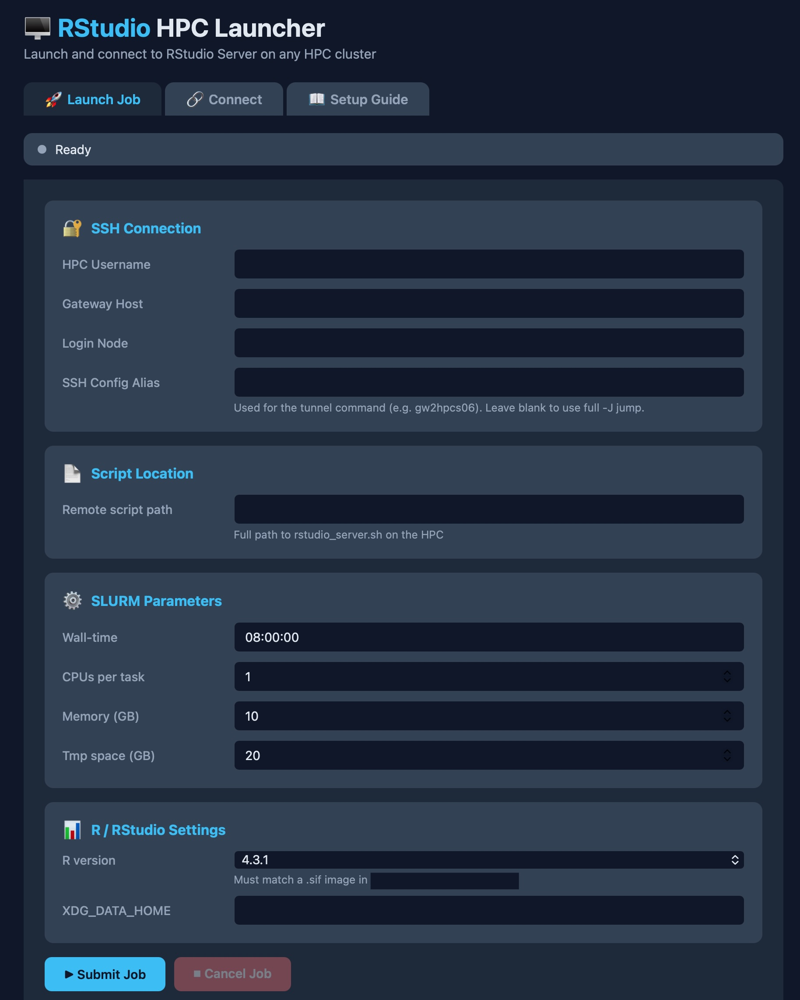
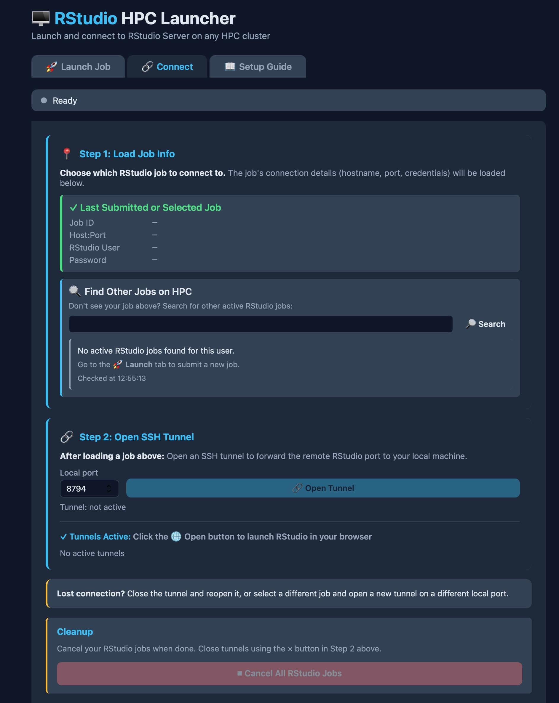
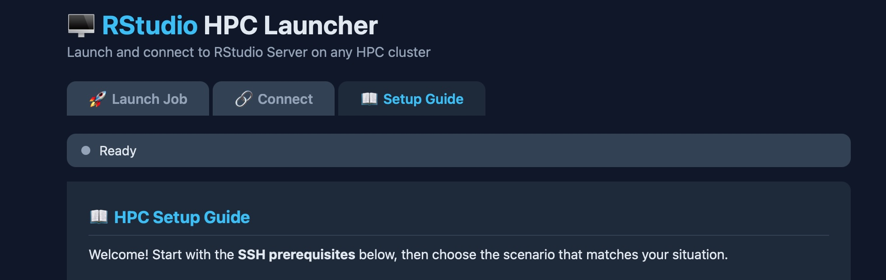

# 🖥️ RStudio HPC Launcher

A graphical launcher for RStudio Server on any HPC cluster. No manual SSH commands or script editing required — just fill in a form and click submit.

**Works on macOS, Linux, and Windows** (where Python and SSH access are available).

---

## What is this?

This app lets you:
- 🎛️ Configure SLURM job parameters (time, CPUs, memory, R version) in a nice web interface
- 🚀 Submit jobs to the HPC with one click
- 🔗 Automatically open SSH tunnels to reach RStudio Server
- 💾 Remember your settings between launches
- 🌐 Open RStudio in your browser automatically

It's designed for **macOS users** who want a native app experience, but also works on **any system with Python and SSH**.

---

## Prerequisites

You need:
1. **Python 3.9 or later** – macOS users have this built-in; Linux/Windows users can download it
2. **SSH access to the HPC gateway** (`hpcgw.op.umcutrecht.nl`)  
   - You should already be set up if you use the HPC at all
3. **A script file** on the HPC (`rstudio_server.sh`)  
   - Use the included template: `rstudio_server_template.sh`

---

## Installation & Running

1. Download or fork the repository to your laptop.
2. Follow steps below

### 🍎 macOS Users

**Option 1: Double-click the app (easiest)**
1. In Finder, navigate to the folder containing this repo
2. Double-click **`RStudioHPCLauncher.app`**
3. A native window opens — done!

The app will:
- Create a Python virtual environment (first time only)
- Install dependencies automatically
- Launch the web interface
- Save your settings automatically

**Option 2: Run from terminal**
(/path/to/rstudioHpc = location of this repo)
```bash
cd /path/to/rstudioHpc
python3 -m venv venv
source venv/bin/activate
pip3 install -r requirements.txt
python rstudio_launcher.py
```

If your mac says that it cant verify the app, go to settings>privacy &security > security and click on open anyway for the RStudioLauncher

### 🐧 Linux & Windows Users

```bash
# Navigate to the project folder
cd /path/to/rstudioHpc

# Create a virtual environment (recommended)
python3 -m venv venv
source venv/bin/activate    # On Windows: venv\Scripts\activate

# Install dependencies
pip3 install -r requirements.txt

# Run the app
python rstudio_launcher.py
```

The app opens in your default browser at `http://localhost:5050`.

---

## Quick Start

### Step 1: Set up your HPC directories & script

Follow the **Setup Guide** inside the app (📖 tab). It has three scenarios:
1. **Fresh Setup** – Never used RStudio on the HPC?  
   Download container images, create directories, configure the template script
2. **New R Version** – Your group already has a setup?  
   Just add a new R version and launch
3. **Existing Setup** – Someone in your group already did it?  
   Copy their script, create your personal directories, and you're done

The guide walks you through everything step-by-step.

### Step 2: Launch a job

1. Open the **🚀 Launch Job** tab
2. Fill in your details:
   - **HPC Username**
   - **Script path** (where you put `rstudio_server.sh` on the HPC)
   - **SLURM settings** (time, CPUs, memory) — defaults are fine for most users
   - **R version** and **XDG_DATA_HOME** path
3. Click **Submit Job** and watch the log
4. When it says "Job submitted!", move to the **Connect** tab

### Step 3: Connect to RStudio

1. Go to the **🔗 Connect** tab
2. **Load a job** – Select your job from "Last Submitted" or search in "Find Other Jobs"
3. **Open SSH Tunnel** – Click the button to establish the connection
4. **Open in Browser** – Click the 🌐 Open button next to the active tunnel

Done! You're now running RStudio on the HPC.

To close the tunnel later, click the × button next to it. When you're done, use the **Cleanup** button to cancel your job (the tunnel will close automatically).

---

## Screenshots

### Launch Job Tab


### Connect Tab


### Setup Guide Tab


---

## Files Included

```
rstudio_launcher.py          # Main app (run this)
rstudio_server_template.sh   # Template script — copy and configure this on the HPC
requirements.txt             # Python dependencies
RStudioHPCLauncher.app/      # Standalone macOS app (double-click this)
```

---

## How It Works (Technical)

1. **You fill in a form** with your username, script path, and job parameters
2. **The app connects to the HPC via SSH** using your system's SSH keys/credentials
3. **It reads your script**, replaces `version` and `XDG_DATA_HOME` with your values, and submits it with `sbatch`
4. **It polls the job log** to extract: hostname, port, username, and password
5. **You open an SSH tunnel** from your Mac to the compute node (port forwarding)
6. **You open a browser** to `http://localhost:8787` → RStudio appears

---

## SSH Configuration (Optional but Recommended)

To avoid entering your password repeatedly, add this to `~/.ssh/config` on your local machine:

```
Host gw2hpcs06
    HostName hpcs06.op.umcutrecht.nl
    User YOUR_HPC_USERNAME
    ProxyJump YOUR_HPC_USERNAME@hpcgw.op.umcutrecht.nl
```

Then set **SSH Alias** in the app to `gw2hpcs06`.

---

## Troubleshooting

**Q: I can't select/copy text in the app window**  
A: Text selection is enabled — try clicking and dragging. On macOS, you can also try Cmd+A to select all.

**Q: The app won't start**  
A: Check your Python version: `python3 --version` (should be 3.9+)  
Then run: `pip install -r requirements.txt`

**Q: I'm on Windows/Linux and the `.app` won't open**  
A: That's the macOS bundle — just run `python rstudio_launcher.py` instead.

**Q: "Job submission failed"**  
A: Check your **HPC Username** and **Script path** are correct, and that you have SSH access.

**Q: R can't write files or runs very slowly**  
A: Make sure you set **TMPDIR** in your `.Renviron` file in your R projects. See the Setup Guide for details.

---

## For Groups Sharing This

1. **One person** follows the Fresh Setup in the guide
2. **Everyone else** copies the configured `rstudio_server.sh` script and follows "Existing Setup"
3. Each person creates their own personal directories (session data, temp directory)
4. The group can share the container images and R package library (or each person can have their own)

---

## Questions or Issues?

- Check the **📖 Setup Guide** inside the app — it has detailed instructions for all scenarios
- Review the **Tips & Troubleshooting** section in the Setup Guide

---

## Credits & License

Built on Flask, Paramiko, and PyWebView.  
Adapted from the Rocker Project and original work by Damon Hofman and Amalia Nabuurs.

Created for the UMC Utrecht HPC cluster.
